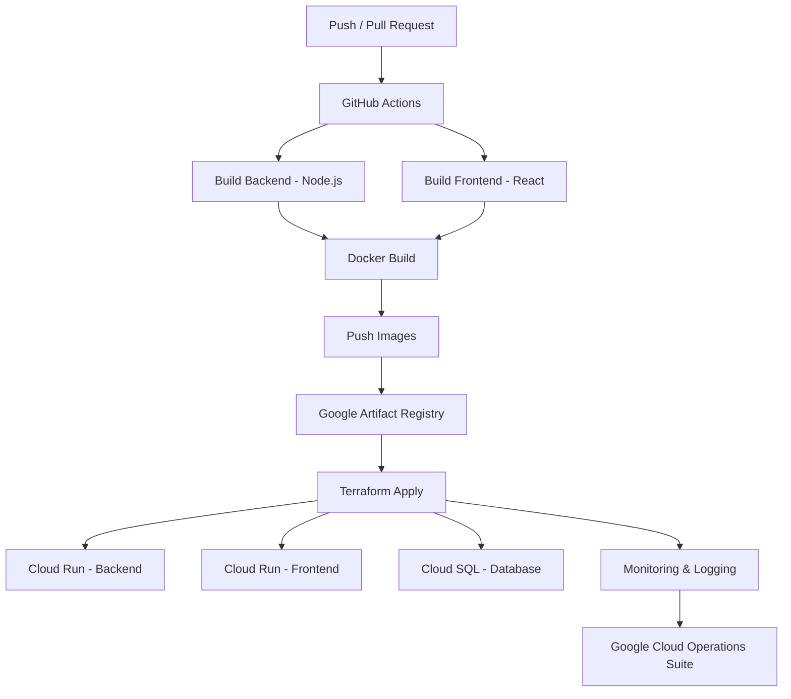
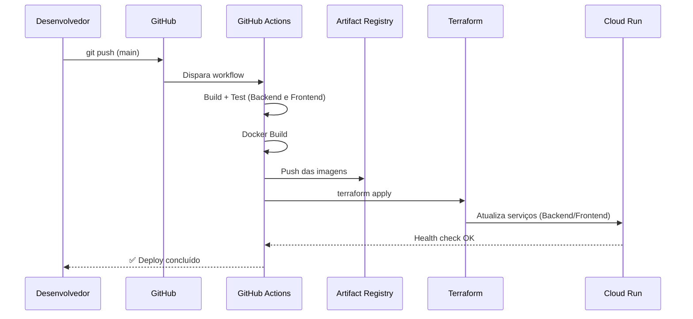

<div align="center">

# ☁️ GCP Fullstack CI/CD Platform
### Plataforma Fullstack com Deploy Automatizado na Google Cloud Platform

[](https://nodejs.org/)
[](https://react.dev/)
[](https://www.docker.com/)
[](https://www.terraform.io/)
[](https://github.com/features/actions)
[](https://cloud.google.com/)
[](#-licença)

**Uma plataforma fullstack moderna com pipeline de CI/CD completo, Infraestrutura como Código e deploy automatizado na Google Cloud Platform.**

[Visão Geral](#-visão-geral) •
[Arquitetura](#%EF%B8%8F-arquitetura) •
[Stack](#%EF%B8%8F-stack-tecnológica) •
[Pipeline CI/CD](#-pipeline-cicd) •
[Infraestrutura](#%EF%B8%8F-infraestrutura-iac) •
[Como Executar](#-como-executar)

</div>

---

## 🌐 Demonstração

| Recurso | Link |
|---|---|
| 🖥️ **Página do Projeto** | [benjaminreiis.github.io/Cloud-DevOps-Platform](https://benjaminreiis.github.io/Cloud-DevOps-Platform/) |
| 📦 **Repositório** | `github.com/benjaminreiis/Cloud-DevOps-Platform` |

---

## 🚀 Visão Geral

Este projeto demonstra uma **arquitetura completa de produção**, simulando o ambiente real utilizado em empresas de tecnologia para entregar software de forma contínua, segura e escalável na nuvem.

A plataforma combina quatro pilares fundamentais de engenharia moderna:

| Pilar | O que representa aqui |
|---|---|
| 🖥️ **Aplicação Fullstack** | Backend em Node.js + Frontend em React |
| 📦 **Containerização** | Empacotamento de cada serviço com Docker |
| 🏗️ **Infraestrutura como Código** | Provisionamento declarativo via Terraform |
| 🔁 **CI/CD** | Build, teste e deploy automatizados com GitHub Actions |

---

## 🧠 Objetivo do Projeto

Simular um ambiente real de produção utilizado em empresas de tecnologia, onde:

- ✅ O código é **versionado** no GitHub
- ✅ O **deploy é automatizado**, sem intervenção manual
- ✅ A **infraestrutura é declarativa** (Infrastructure as Code)
- ✅ O sistema é **escalável** e **monitorado** continuamente

> 💡 Mais do que "fazer deploy", o objetivo é demonstrar o **ciclo de vida completo** de uma aplicação em produção: do commit no GitHub até a observabilidade do serviço rodando na nuvem.

---

## 🏗️ Arquitetura

```text
GitHub
   │
   ▼
GitHub Actions (CI/CD)
   │
   ├── Build Backend (Node.js)
   ├── Build Frontend (React)
   ├── Docker Build
   └── Push Images
        │
        ▼
Google Artifact Registry
        │
        ▼
Terraform Deploy
        │
        ├── Cloud Run (Backend)
        ├── Cloud Run (Frontend)
        ├── Cloud SQL (Database)
        └── Monitoring & Logging
        │
        ▼
Google Cloud Operations Suite
```

### Fluxo Visual (Mermaid)



### Camadas da Arquitetura

| Camada | Componente | Responsabilidade |
|---|---|---|
| **Versionamento** | GitHub | Repositório de código-fonte e gatilho do pipeline |
| **CI/CD** | GitHub Actions | Build, testes e orquestração do deploy |
| **Containerização** | Docker | Empacotamento de backend e frontend em imagens isoladas |
| **Registro de Imagens** | Google Artifact Registry | Armazenamento versionado das imagens Docker |
| **IaC** | Terraform | Provisionamento declarativo de toda a infraestrutura GCP |
| **Compute** | Cloud Run (Backend e Frontend) | Execução serverless e escalável dos serviços |
| **Dados** | Cloud SQL | Banco de dados relacional gerenciado |
| **Observabilidade** | Google Cloud Operations Suite | Logs, métricas e monitoramento dos serviços |

---

## ⚙️ Stack Tecnológica

### Aplicação

| Camada | Tecnologia |
|---|---|
| **Backend** | Node.js |
| **Frontend** | React |
| **Containerização** | Docker |

### Infraestrutura & Deploy

| Categoria | Tecnologia |
|---|---|
| **IaC** | Terraform |
| **CI/CD** | GitHub Actions |
| **Cloud Provider** | Google Cloud Platform (GCP) |
| **Compute** | Cloud Run |
| **Banco de Dados** | Cloud SQL |
| **Registro de Containers** | Google Artifact Registry |
| **Observabilidade** | Google Cloud Operations Suite (Logging + Monitoring) |

---

## 📂 Estrutura do Projeto

```text
gcp-fullstack-cicd-platform/
│
├── backend/
│   ├── src/
│   ├── Dockerfile
│   └── package.json
│
├── frontend/
│   ├── src/
│   ├── Dockerfile
│   └── package.json
│
├── infra/
│   ├── main.tf            # Definição principal dos recursos GCP
│   ├── variables.tf        # Variáveis de configuração
│   ├── outputs.tf          # Outputs (URLs, IPs, IDs de recursos)
│   └── modules/            # Módulos Terraform reutilizáveis
│       ├── cloud-run/
│       ├── cloud-sql/
│       └── artifact-registry/
│
├── .github/
│   └── workflows/
│       ├── ci.yml          # Build, lint e testes
│       └── deploy.yml      # Deploy automatizado na GCP
│
├── docker-compose.yml       # Ambiente local de desenvolvimento
└── README.md
```

---

## 🔁 Pipeline CI/CD

O pipeline é dividido em duas fases principais, ambas orquestradas via **GitHub Actions**:

### 1️⃣ Integração Contínua (CI)
Disparada em todo `push` ou `pull request`:
- Instalação de dependências (backend e frontend)
- Lint e verificação de tipos
- Execução dos testes automatizados
- Build das imagens Docker (validação, sem push)

### 2️⃣ Entrega Contínua (CD)
Disparada após merge na branch principal:
- Build das imagens de produção (backend e frontend)
- Push das imagens para o **Google Artifact Registry**
- Autenticação na GCP via **Workload Identity Federation** (sem chaves estáticas)
- Execução do `terraform apply` para atualizar a infraestrutura
- Deploy das novas imagens no **Cloud Run**
- Verificação de saúde (*health check*) pós-deploy



---

## 🏗️ Infraestrutura (IaC)

Toda a infraestrutura é provisionada de forma **declarativa** com Terraform, eliminando configuração manual via console da GCP.

### Recursos provisionados

```hcl
# Exemplo ilustrativo da estrutura de recursos (infra/main.tf)

resource "google_cloud_run_v2_service" "backend" {
  name     = "backend-service"
  location = var.region

  template {
    containers {
      image = "${var.artifact_registry_url}/backend:latest"
    }
  }
}

resource "google_cloud_run_v2_service" "frontend" {
  name     = "frontend-service"
  location = var.region

  template {
    containers {
      image = "${var.artifact_registry_url}/frontend:latest"
    }
  }
}

resource "google_sql_database_instance" "main" {
  name             = "app-database"
  database_version = "POSTGRES_15"
  region           = var.region
}
```

### Comandos principais

```bash
cd infra

# Inicializa o Terraform e baixa providers
terraform init

# Mostra o plano de execução (o que será criado/alterado)
terraform plan

# Aplica as mudanças na infraestrutura
terraform apply

# Remove toda a infraestrutura provisionada
terraform destroy
```

---

## 📊 Monitoramento e Observabilidade

A plataforma utiliza o **Google Cloud Operations Suite** para garantir visibilidade total sobre o sistema em produção:

- **Cloud Logging** — logs centralizados de backend, frontend e infraestrutura
- **Cloud Monitoring** — métricas de uso de CPU, memória, latência e número de requisições
- **Alertas** — notificações automáticas em caso de falhas ou degradação de performance
- **Health Checks** — verificação contínua da disponibilidade dos serviços no Cloud Run

---

## 🚀 Como Executar

### Pré-requisitos
- [Node.js 20+](https://nodejs.org/)
- [Docker](https://www.docker.com/) e Docker Compose
- [Terraform CLI](https://developer.hashicorp.com/terraform/install)
- [Google Cloud CLI](https://cloud.google.com/sdk/docs/install) (`gcloud`)
- Uma conta no Google Cloud Platform com billing habilitado

### 1. Clone o repositório
```bash
git clone https://github.com/benjaminreiis/Cloud-DevOps-Platform.git
cd Cloud-DevOps-Platform
```

### 2. Ambiente local (desenvolvimento)
```bash
docker-compose up --build
```
- Frontend: `http://localhost:3000`
- Backend: `http://localhost:4000`

### 3. Autenticação na GCP
```bash
gcloud auth login
gcloud config set project SEU_PROJECT_ID
gcloud auth application-default login
```

### 4. Provisionar infraestrutura na nuvem
```bash
cd infra
terraform init
terraform plan
terraform apply
```

### 5. Deploy automatizado via CI/CD
Basta fazer push na branch `main` — o GitHub Actions assume o restante do processo (build, push das imagens e `terraform apply`).

```bash
git push origin main
```

---

## 🔐 Variáveis e Secrets Necessários

Configurados como **Secrets** no repositório GitHub (`Settings > Secrets and variables > Actions`):

| Secret | Descrição |
|---|---|
| `GCP_PROJECT_ID` | ID do projeto na Google Cloud |
| `GCP_REGION` | Região de deploy (ex: `southamerica-east1`) |
| `GCP_WORKLOAD_IDENTITY_PROVIDER` | Provedor de identidade para autenticação sem chaves estáticas |
| `GCP_SERVICE_ACCOUNT` | Service Account utilizada pelo pipeline |
| `ARTIFACT_REGISTRY_REPO` | Nome do repositório no Artifact Registry |

> 🔒 Por boas práticas de segurança, a autenticação com a GCP é feita via **Workload Identity Federation**, eliminando a necessidade de armazenar chaves de Service Account como secrets estáticos.

---

## 🗺️ Roadmap

- [ ] Ambientes separados (staging e produção)
- [ ] Testes de carga automatizados pós-deploy
- [ ] Rollback automático em caso de falha no health check
- [ ] Dashboards customizados no Cloud Monitoring
- [ ] Política de autoscaling refinada por serviço
- [ ] Versionamento semântico automatizado (semantic-release)

---

## 🎯 Objetivo

Este projeto foi desenvolvido para demonstrar conhecimento prático em **DevOps**, **Cloud Engineering** e **Infraestrutura como Código**, servindo como peça de portfólio para oportunidades nas áreas de **Backend**, **DevOps** e **Cloud**.

---

## 🤝 Como Contribuir

1. Faça um fork do projeto
2. Crie uma branch (`git checkout -b feature/minha-feature`)
3. Commit suas alterações (`git commit -m 'feat: adiciona minha feature'`)
4. Push para a branch (`git push origin feature/minha-feature`)
5. Abra um Pull Request

---

## 👨‍💻 Autor

**Benjamin Reis**

Backend & DevOps — Python · Node.js · FastAPI · GCP · Terraform · Docker

[](https://github.com/benjaminreiis)

---

## 📄 Licença

Este projeto está sob a licença MIT. Veja o arquivo [LICENSE](LICENSE) para mais detalhes.

---

<div align="center">

⭐ Se este projeto foi útil, considere deixar uma estrela no repositório!

</div>
